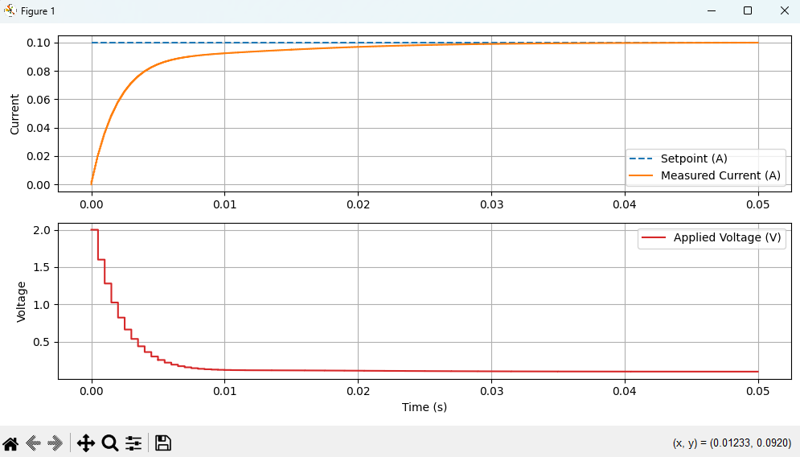

# ADRC Control Demos (Python)

Welcome! This project demonstrates how to use **ADRC (Active Disturbance Rejection Control)** to control an RL (Resistor–Inductor) circuit and a DC motor, with all simulation and visualization handled in **Python**.

---

## Folder Structure

- `demos/`  
  Example scripts for running ADRC controllers on RL circuit and DC motor:
  - `adrc_dc_motor.py`: DC motor controlled by a second-order ADRC controller
  - `adrc_RL_circuit.py`: RL circuit controlled by a first-order ADRC controller
- `docs/`  
  Documentation and tutorials, including detailed ADRC theory and tuning guides.
- `adrc/`  
  Python code for the ADRC controller.
- `simulation/plants/`  
  Python code for the plant models (RL circuit, DC motor).
- `simulation/`  
  Python framework for simulating and plotting the control system.
- `tests/`  
  Unit tests.

---

## How It Works

- **ADRC Controller:**  
  Modern robust controller with real-time disturbance estimation. First-order ADRC is used for the RL circuit, and second-order ADRC for the DC motor.

- **Simulation:**  
  All simulation logic, plant modeling, and visualization are handled in Python.

---

## Example Output

Below is a typical result from running a demo.  
The ADRC controller regulates the plant output to reach the setpoint:



- **Top:** Plant output (orange) tracks the setpoint (blue dashed).
- **Bottom:** Control input applied by the controller.

---

## Getting Started

1. Open the project folder in **Visual Studio Code** (or your favorite Python IDE).
2. (Optional) Create and activate a virtual environment:

  ```bash
  python -m venv venv
  # On Windows:
  venv\Scripts\activate
  ```

3. Install dependencies:

  ```bash
  pip install -r requirements.txt
  ```

4. Run a demo script:

  ```bash
  python demos/adrc_RL_circuit.py
  python demos/adrc_dc_motor.py
  ```

---

## Demo Scripts

- **RL Circuit with ADRC:**
  - `demos/adrc_RL_circuit.py`
  - Uses a first-order ADRC controller to regulate current in an RL circuit.
  - Tuning parameters: sample time, observer bandwidth, controller bandwidth, b0.

- **DC Motor with ADRC:**
  - `demos/adrc_dc_motor.py`
  - Uses a second-order ADRC controller to regulate speed of a DC motor.
  - Tuning parameters: sample time, observer bandwidth, controller bandwidth, b0.

---

## Learn More
Want to understand **how ADRC works** and how to tune it?
[Read my ADRC turorial](docs/ADRC_tutorial.md)

- For ADRC theory and tuning, see the code comments and [external ADRC resources](https://en.wikipedia.org/wiki/Active_disturbance_rejection_control).

---

## License

MIT License

